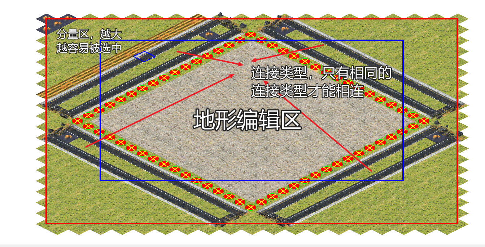
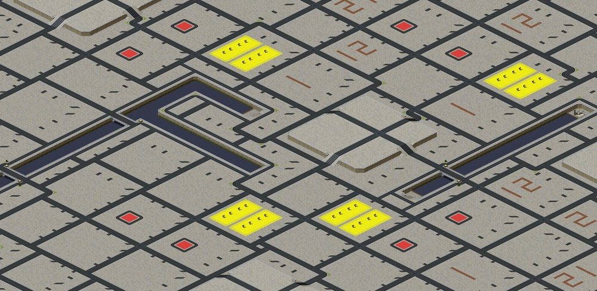

# RandomMapGenerator_RA2 #
How to use
-------
- download release or clone & build
- change game folder in settings.ini
- click run.bat to create random map
- click help.bat to see additional command lines
- examples of map units can be seen in /MapUnits

Acknowledgments
-------

Special thanks go out to authors of several modding tools that have greatly benefited the community as well as development of this program:

- planetarianPKU
- Olaf van der Spek for XCC and XWIS
- The OpenRA project
- All contributors to ModEnc
- The CNCMaps Renderer 's maker zzattack.

License
-------

The license below applies only to those parts of the program that do not contain a conflicting license placed at the top of the source file. These include parts from the OpenRA and XCC projects, which are licenced under the GPL v3.

(The MIT License)

Copyright (c) 2007-2013 Frank Razenberg

Permission is hereby granted, free of charge, to any person obtaining a copy of this software and associated documentation files (the 'Software'), to deal in the Software without restriction, including without limitation the rights to use, copy, modify, merge, publish, distribute, sublicense, and/or sell copies of the Software, and to permit persons to whom the Software is furnished to do so, subject to the following conditions:

The above copyright notice and this permission notice shall be included in all copies or substantial portions of the Software.

THE SOFTWARE IS PROVIDED 'AS IS', WITHOUT WARRANTY OF ANY KIND, EXPRESS OR IMPLIED, INCLUDING BUT NOT LIMITED TO THE WARRANTIES OF MERCHANTABILITY, FITNESS FOR A PARTICULAR PURPOSE AND NONINFRINGEMENT. IN NO EVENT SHALL THE AUTHORS OR COPYRIGHT HOLDERS BE LIABLE FOR ANY CLAIM, DAMAGES OR OTHER LIABILITY, WHETHER IN AN ACTION OF CONTRACT, TORT OR OTHERWISE, ARISING FROM, OUT OF OR IN CONNECTION WITH THE SOFTWARE OR THE USE OR OTHER DEALINGS IN THE SOFTWARE.
